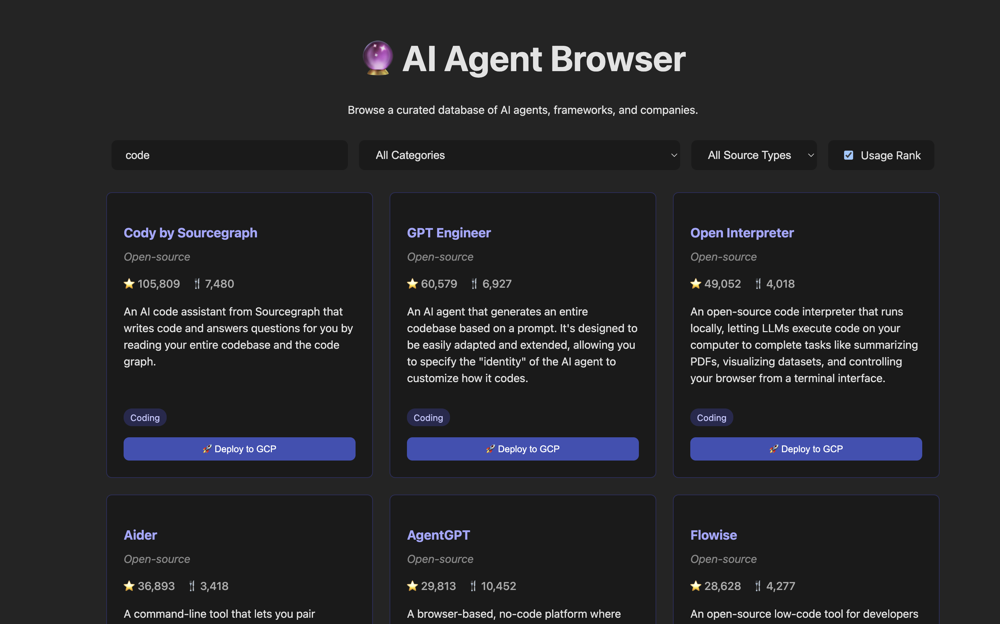

# 🔮 AI Agent Browser

A full-stack web application to browse, search, and filter a curated database of over 200 AI agents, frameworks, and companies. This project provides a simple yet powerful interface to explore the rapidly growing AI agent ecosystem.


> **Note:** It's highly recommended to replace the image link above with your own screenshot of the running application!

## ✨ Features

-   **Comprehensive Database**: Contains over 1600 entries, including both open-source and closed-source projects.
-   **Full-Text Search**: Instantly find agents by name or description.
-   **Dynamic Filtering**:
    -   Filter by `source type` (Open-source vs. Closed-source).
    -   Filter by specific `category` (e.g., "Coding", "Productivity", "Data analysis").
-   **Simple & Fast Interface**: Built with React and Vite for a smooth user experience.
-   **Self-Contained Backend**: A lightweight Node.js server with a file-based SQLite database.

## 🛠️ Tech Stack

-   **Backend**:
    -   **Runtime**: Node.js
    -   **Framework**: Express.js
    -   **Database**: SQLite3 (file-based)
    -   **Middleware**: CORS
-   **Frontend**:
    -   **Library**: React
    -   **Build Tool**: Vite
    -   **Styling**: Vanilla CSS

## 🚀 Getting Started

Follow these instructions to get a copy of the project up and running on your local machine for development and testing purposes.

### Prerequisites

-   [Node.js](https://nodejs.org/) (Version `20.19+` or `22.12+` recommended)
-   [npm](https://www.npmjs.com/) (comes with Node.js)
-   [Git](https://git-scm.com/)

### Installation

1.  **Clone the repository:**
    ```bash
    git clone [https://github.com/agulli/ai-agent-browser.git](https://github.com/agulli/ai-agent-browser.git)
    cd ai-agent-browser
    ```

2.  **Set up the Backend:**
    ```bash
    cd backend
    npm install
    ```

3.  **Set up the Frontend:**
    ```bash
    cd ../frontend
    npm install
    ```

## 🏃 Running the Application

You will need two separate terminal windows to run both the backend and frontend servers simultaneously.

1.  **Start the Backend Server:**
    -   Navigate to the `backend` directory.
    -   The first time you run this, it will automatically create and populate the `ai_agents.db` database file from `agents.json`.
    ```bash
    cd backend
    node server.js
    ```
    The backend API will be running at `http://localhost:3001`.

2.  **Start the Frontend Development Server:**
    -   In a new terminal, navigate to the `frontend` directory.
    ```bash
    cd frontend
    npm run dev
    ```
    The frontend application will be available at `http://localhost:5173` (or another port if 5173 is busy).

3.  **Open the App:**
    Open your web browser and navigate to `http://localhost:5173`. You should now see the AI Agent Browser in action!

## 📁 Project Structure

```
/
├── backend/
│   ├── agents.json         # The raw data source
│   ├── ai_agents.db        # The SQLite database (auto-generated)
│   ├── database.js         # DB initialization and seeding logic
│   ├── package.json
│   └── server.js           # The Express API server
│
├── frontend/
│   ├── src/
│   │   ├── App.jsx         # Main React component
│   │   └── index.css       # Main stylesheet
│   ├── index.html
│   ├── package.json
│   └── vite.config.js
│
└── README.md
```

## 📄 License

This project is licensed under the MIT License - see the [LICENSE.md](LICENSE.md) file for details.